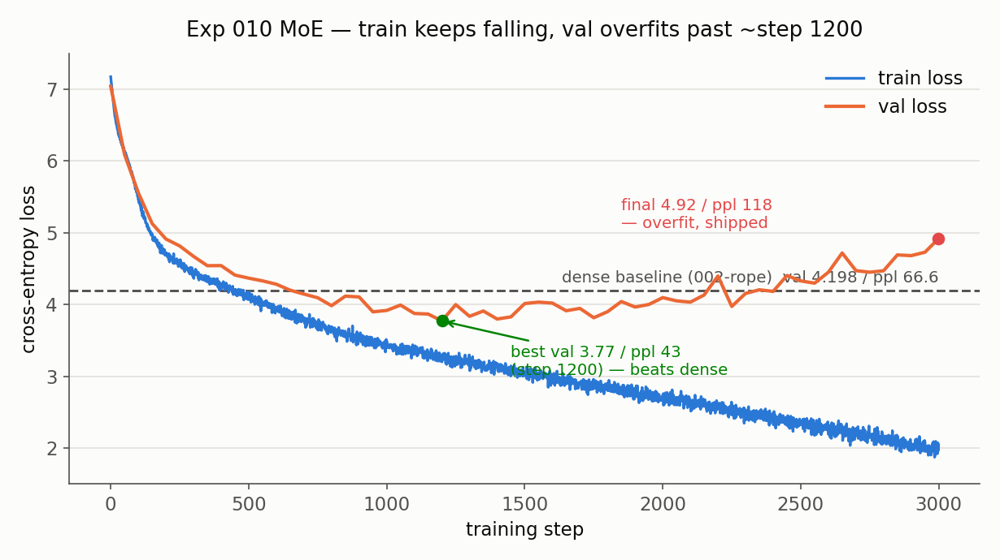
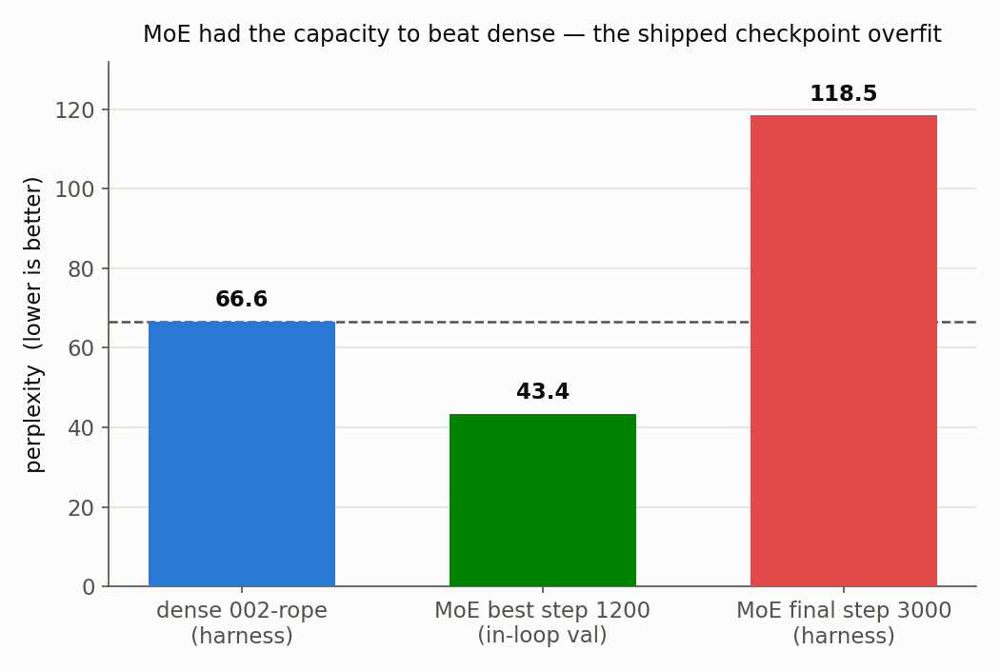

# Experiment 010: Mixture of Experts (dense FFN → routed MoE FFN) — Results

## Outcome

**The shipped MoE checkpoint is worse than the dense baseline (ppl 118.5 vs
66.6), but not because the architecture failed — because 4× the FFN parameters
overfit the tiny corpus.** Trained from scratch with each block's dense FFN
replaced by a top-2-of-4 routed MoE (compute-matched experts, `d_ff=512` each,
FP32, Switch/GShard load-balancing aux loss at α=0.01), the model's validation
loss fell *below* the dense baseline for roughly steps 750–1750, bottoming at
**val 3.77 / ppl ~43 at step 1200** — comfortably beating dense's 66.6 — then
climbed back to **val 4.92** by step 3000 as it overfit. The final checkpoint,
scored on 005's 20-fixed-batch harness, lands at **ppl 118.5**.

So the honest reading is two-part: (1) at this scale the extra capacity of a
4-expert pool *can* outperform one dense FFN, but (2) with no early stopping and
a ~1000-token corpus, that same capacity overfits hard, and the end-of-training
checkpoint we ship is well past the sweet spot. The load balancer, separately,
worked exactly as designed — all four experts stayed evenly utilized start to
finish, no collapse.

## Head-to-head (005's 20-fixed-batch harness, 002 checkpoint axis)

| Model | FFN | val loss | ppl | notes |
|---|---|---|---|---|
| 002-rope | dense | 4.198 | 66.6 | baseline (harness) |
| **010** | **MoE top-2/4** | **4.775** | **118.5** | final checkpoint (harness) |
| 010 (best) | MoE top-2/4 | 3.77 | ~43 | step-1200 in-loop val — see measurement note |

## The story in two figures

**Train keeps falling; val overfits past ~step 1200.**

Train loss (blue) slides monotonically from 7.17 to 2.08. Val loss (orange)
troughs at 3.77 (step 1200, green) — under the dense-baseline reference line
(dashed, val 4.198) — then turns and rises to 4.92 (red). The widening gap
between the two curves *is* the overfitting: the model keeps memorizing the
train split while generalization degrades.

**MoE had the capacity to beat dense — the shipped checkpoint overfit.**

Left to right: dense 66.6, MoE at its best ~43, MoE final 118.5. The middle bar
sits *below* the dashed dense line; the right bar is nearly double it. Same arc,
one chart.

## Load balancing worked (no collapse)

Every logged eval step shows per-expert token fractions pinned to
`[~0.50, ~0.50, ~0.50, ~0.50]` (band 0.48–0.53) and the raw aux loss flat at
~8.00 across the whole 3000-step run — the balanced state for top-2-of-4 (each
of 4 experts carrying half the tokens; fractions sum to top_k=2). No expert went
dead, no expert hogged the batch. The α=0.01 Switch/GShard auxiliary loss held
the router in balance from step 0 onward. (The mission's α=0 collapse demo — the
control that shows fractions splitting toward `[~1, ~1, ~0, ~0]` without this
loss — was not run for this write-up; it remains a cheap follow-up.)

## Measurement note

The **66.6** and **118.5** numbers are on the identical 005 axis: 002's
`tokenizer.json` loaded verbatim (byte-identical vocab), same
`data/tinyshakespeare.txt`, same val split (last 10%), same fixed batches
(seed 1234, 20 batches, batch_size 16). The eval reconstructs the checkpoint's
model (`use_moe=True`, 4 `MoEFeedForward` blocks confirmed at eval time) and
runs a plain forward pass — no post-hoc step. Eval script: `eval_005harness.py`.

The **~43 "best"** is *not* on the harness axis: only the final checkpoint was
saved, so the step-1200 model can't be re-scored. That number is the minimum of
the in-loop val curve (random val batches, a different eval set). It's directionally
trustworthy — in-loop and harness track closely at the end (in-loop final 4.92 vs
harness 4.775) — but treat ~43 as an estimate, not a measured harness ppl. The
figures label each bar's axis accordingly.

**Sanity trap avoided:** the *first* 010 run silently trained a dense model — a
CLI-wiring bug dropped the `--use-moe` flags before they reached `TrainConfig`,
and it reproduced 002-rope exactly (66.6, `use_moe=False`, 0 MoE blocks). The
eval harness's `use_moe`/block-count print caught it; the fix threads the flags
through `_parse_args` and adds a regression test on the CLI path. The run above
is the corrected, genuinely-MoE run (checkpoint 10.5 MB vs the dense 4.2 MB — the
~4× FFN params are really there).

## Wall-clock

`timing training_seconds 10252.7` (~2h51m, 0.29 steps/s on the GPU-less fleet
box) — roughly 1.8× the dense run, consistent with compute-all-then-mask running
all 4 experts per token.

## Takeaways / next

- **The mechanism is correct and measurable.** Routing, top-2 weighted combine,
  and load balancing all behave as designed and are traceable
  (`trace_routing.py`) — the primary goal of 010.
- **Capacity without data overfits.** The clearest lesson: 4× FFN params need
  more than a ~1000-token corpus. This is the direct motivation for **exp 011**
  (bigger corpus + vocab, with its own retrained dense baseline) — the regime
  where experts have room to specialize instead of memorize.
- **Cheap follow-ups:** early-stopping / checkpoint-on-best-val to recover the
  ~43 ppl model; the α=0 collapse demo; true sparse dispatch + capacity for the
  efficiency story; ternary experts (`quantize_linears=True`) for the
  on-mission integer-matmul combination.
